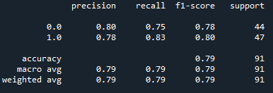
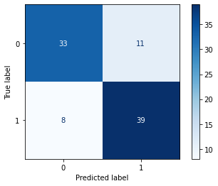
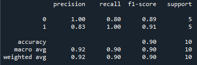

# Heart Attack Analysis & Prediction Using Machine Learning

The aim of this project is to design a machine learning model that is able to diagnose cardiovascular disease using clinical data.
The dataset used contains 14 unique attributes such as age, sex, chest pain type, resting blood pressure etc. 

## Prerequisites

This script uses the following python libraries:
1. Pandas
2. Numpy
3. SciPy
4. Scikit-Learn
5. MatPlotLib
6. Seaborn
7. Streamlit

## Model Development

Using a machine learning pipeline, it is determined that the best scaler and best classifier for this data is MinMaxScaler and LogisticRegression respectively, with an accuracy score of 0.79.

The performance of the model is further improved via hyperparameter tuning.

The following figures display how the model performs on the test dataset (y_test):

### Classification report

### Confusion matrix

All evaluation metrics (precision, recall, f1-score, accuracy) were higher than 0.70.

## Model Deployment
To further evaluate the performance of the model, a set of data independent of the training data was used to determine its accuracy.

Using this data, the accuracy of the model was found to be 0.90.

## App Deployment
An app was designed using Streamlit to allow usage of the trained model on a web browser.

The following gif demonstrates how the app is used once it is deployed.

## Credits

Data : [Heart Attack Analysis & Prediction Dataset](https://www.kaggle.com/datasets/rashikrahmanpritom/heart-attack-analysis-prediction-dataset)

Thank you for reading! :smile_cat:
